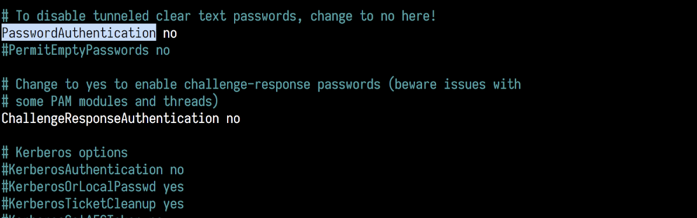
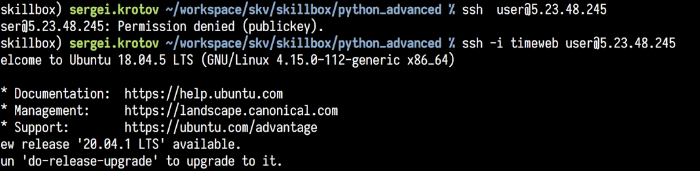

#### Урок 3, задание 2

_Опционально_. Если вы чувствуете себя уверенным в себе пользователем Linux,
    то обращу ваше внимание на такой факт:
    
Вы до сих пор можете зайти на машину под пользователем user по логину и паролю.
Достаточно просто забыть указать файл с закрытым ключём в качестве аргумента.
Это можно исправить. 

Зайдём на сервер и отредактируем файл конфигурации ssh.

Учтите, это действие может быть опасным если вы ошибётесь.
Мы сейчас зашли на сервер по ssh и если совершим ошибку -- уже можем и не зайти.
Могу это сравнить только с фигурной резкой по ветке, на которой мы сидим.

Итак зайдите на сервер, откройте файл конфигурации ssh
```shell script
$ sudo nano /etc/ssh/sshd_config
```

стрелочкой вниз домотайте до строки с `PasswordAuthentication` и вместо `yes` напишите `no`



нажмите `Ctrl+O` для сохранения, `Ctrl+X` для выхода.

После этого перечитайте конфигурацию сервера `sshd` (сервер ssh daemon)

```shell script
$ sudo systemctl reload sshd.service
```

Теперь всё работает как надо!




